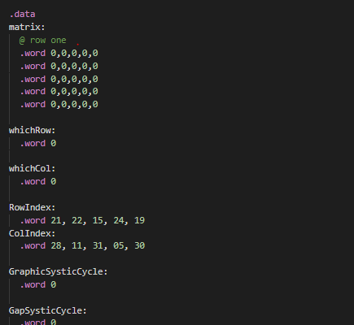

# Design Description

This piece of program can illustrate a digital pet that controlled by you, and endless running for life. The program will spawn waves of "asteriods" from the top of the led screen, and they will coming down for the pet. Each wave will have a random gap, produced by a random number generator provided by Microbit, so the pet can pass one wave by putting itself at that position. Use button A and button B to control the pet in order to survive the waves. The waves' speed coming down will increase as more waves successfully doged. When game over, the number of successfully doged waves will be displayed, the dots in the right indicates the ones digit, the left indicates the tens digit. The following pic indicate 41. Please push the button in the behind of the microbit to refreash the game and play it again.

## Implementation: Data structure

A 5x5 matrix is used for render the whole LED array, and few other arrays are used to record the “asteroid waves” in the game, like the .data memory labeled “Gap”, every time player passed a cycle of asteroids, a random new Gap will be generated and saved there, later updated into matrix. Other than arrays, there are other memory to store the current states of the game, like “is the game running?”, “how many frames has passed?”, and loop indexes.
## Control Flow
The program is made with two parts, main Loop and interrupts. The main loop keeps running, checking game status saved in memory, and do tasks according to status. While interrupts manipulate the status. The main looper is assembled with three sub loopers: graphicRenderLooper, gapLooper and scoreLooper, they are independent to each other. Only two Interrupts are activated here, Systic and IRQ. Systic interrupts the control flow at a constant rate and add ones to memory “GraphicSysticCycle” (and others), when graphicRenderLooper read that a one, a frame of picture is rendered from the “matrix”. The same logic goes to other looper, for example, Game running? Activate certain tasks in gapLooper. The Gap reach the bottom? Check whether octopus passed the gap. Game over? Activate certain tasks in scoreLooper. IRQ handler will read the input value and either add or minus one to a certain memory label, “petLocation”. That will later be picked by gapLooper and get rendered into picture.

## Superiority of this design
By simply using a piece of memory, “matrix”, instead of directly loading LED memories, I can just load ones and zeros in the 5x5 matrix. Other than that, this mainLooper design connect the separate features but also keep them independent. Like between rendering graphic and updating Gaps, I can freely manipulate the picture output without worrying about “can I move the gap at this time without messing up the LED memory storing workflow”. As long I am out of the looper that uses this memory, I can change it as free as I can, and at the next time that looper runs again, it sees the update. There is no hand code picture in this program, every pic illustrated are generative picture.
This design is a super convenient way to display moving pictures, its extension potential is infinite! Update the LED to 50x50, good bye microbit hello Gameboy.

